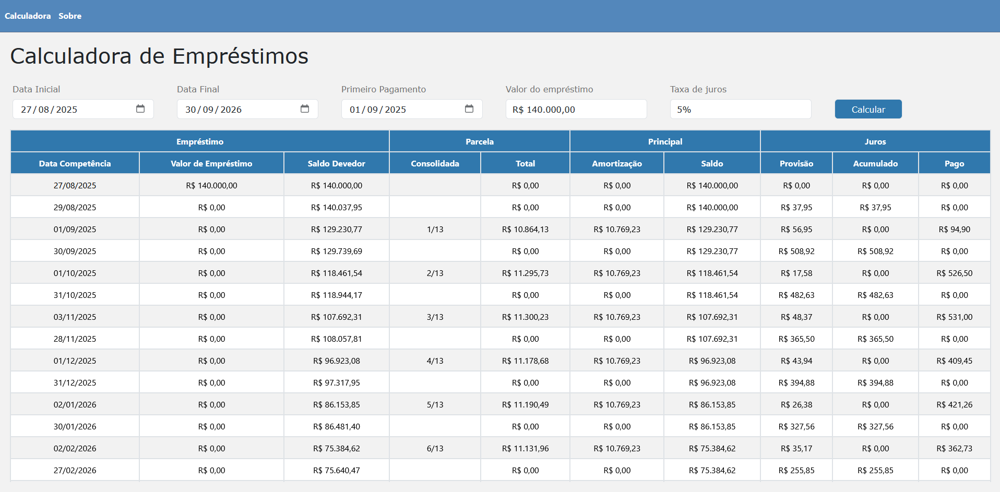

# Calculadora de Empréstimos

Este projeto tem como objetivo fornecer uma calculadora de empréstimos simples e eficiente, desenvolvida como parte do teste técnico para a TOTVS.

## Finalidade

A aplicação permite ao usuário simular empréstimos, informando valores, taxas de juros e prazos, retornando o valor das parcelas e o custo total do empréstimo. É ideal para quem deseja planejar suas finanças e entender melhor as condições de crédito disponíveis.

## Funcionalidades

- Simulação de empréstimos com diferentes taxas e prazos
- Cálculo automático do valor das parcelas
- Exibição do custo total do empréstimo
- Interface intuitiva e fácil de usar

## Observações finais

- Não considera feriados nacionais e finais de semana como dia para pagamento, se cair em algum desses casos, o dia do pagamento cai no próximo dia útil. 
- O dia do primeiro pagamento só pode ser dias úteis (Por motivos de processamento bancário)
- O Dia do primeiro pagamento precisa estar dentro da data inicial e final, mas não pode ser ser na exata data inicial e final.
- Se a primeira parcela for no último dia útil do mês, todas as outras precisam ser também respectivamente.

## Preview

## Autor

Rodrigo Destri Perozin

---

Projeto desenvolvido para o teste técnico da TOTVS.